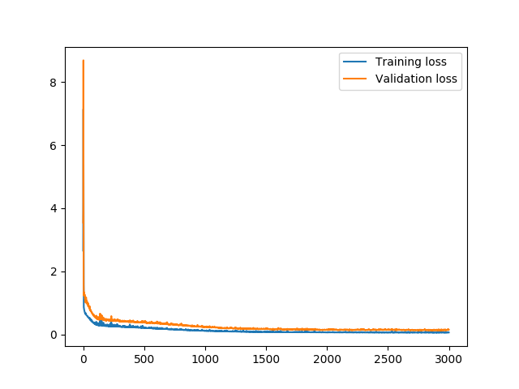
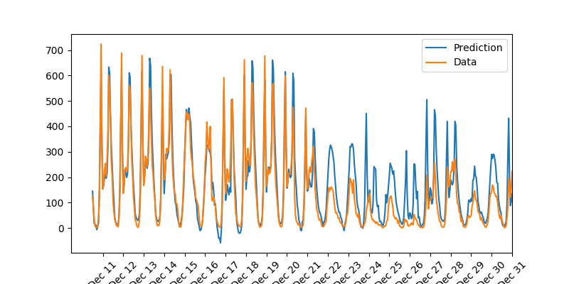

# Neural Network in Numpy for Bike Rental Predictions

## Building a Neural Network from Scratch

This repository contains code for building a neural network using just numpy

The design of the neural network is shown in the following figure:


To run the script, do:
```sh
python main.py
```

It should start training, with logging showing progress like this:
```sh
Progress: 11.3% ... Training loss: 0.240 ... Validation loss: 0.415
```

To run tests, do:
```sh
python bikerental_tests.py
```

## Bike Rental Dataset

The Bike Rental Dataset is from (Kaggle)[https://www.kaggle.com/c/bike-sharing-demand]

The Loss of the Training is shown here:


The Prediction of Bike Rentals is shown here:

